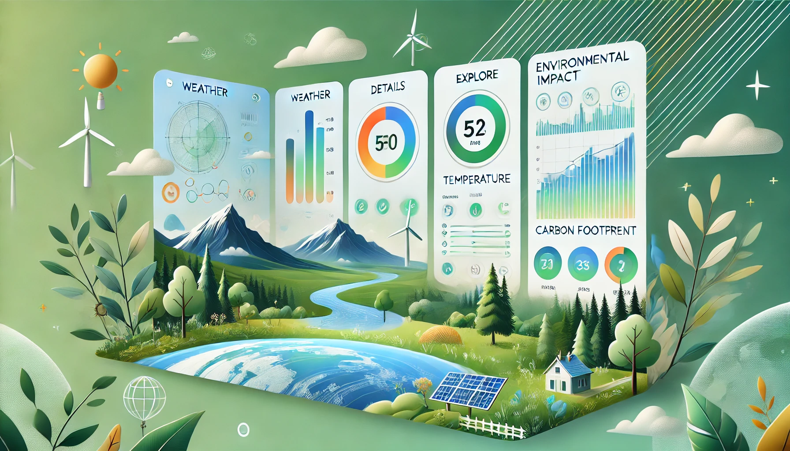

# Environmental Impact Tracker

[]()

## Recommended IDE Setup

[VSCode](https://code.visualstudio.com/) + [Volar](https://marketplace.visualstudio.com/items?itemName=Vue.volar) (and disable Vetur).

## Type Support for `.vue` Imports in TS

TypeScript cannot handle type information for `.vue` imports by default, so we replace the `tsc` CLI with `vue-tsc` for type checking. In editors, we need [Volar](https://marketplace.visualstudio.com/items?itemName=Vue.volar) to make the TypeScript language service aware of `.vue` types.

## Customize configuration

See [Vite Configuration Reference](https://vitejs.dev/config/).

## Project Setup

### clone repo

    `git clone https://github.com/bhubany/environmental-impact-tracker.git`

### Change directory to project directory

```
cd ./environmental-impact-tracker
```

### Install Dependencies

```
npm install
```

### Create `.env` file and copy environment variables from `.example.env`

### Replace dummy variable values in `.env` file with actual values

### Compile and Hot-Reload for Development

```sh
npm run dev
```

### Visit dev URL

[http://localhost:3000/](http://localhost:3000/ 'http://localhost:3000/')

### Type-Check, Compile and Minify for Production

```sh
npm run build
```

### Build preview

```
npm run preview
```

### Lint with [ESLint](https://eslint.org/)

```sh
npm run lint
```
